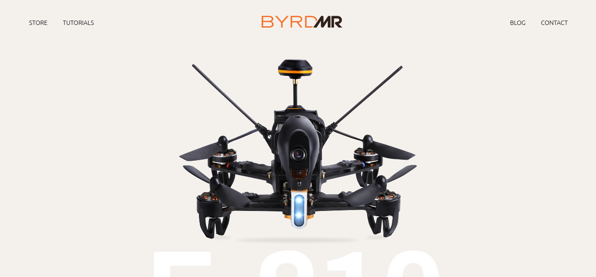

# Paddle-Frontend-Assessment

This is a responsive web clone app, with a dynamic nav bar inline with White-Label-Collaborative assessment test project.

## Built With

- Javascript
- React
- JSX
- HTML
- CSS

## Desktop version:

## Tablet version:

## Mobile version:

## Getting Started

To get a local copy up and running follow these simple example steps.

- Clone the repo by typing `git clone git@github.com:Oxford-G/drone_web_app.git`
- cd into the root directory ` cd drone_web_app`
- `npm install` - This will install all the packages in the package.json file

## Run locally

- `npm start` - This will run the app locally in the local environment
- Go to `https://localhost:3000/` on your browser
- Try it!!

## Author

👤 **Enekwechi Chinonso Gerald**

- GitHub: [@Oxford-G](https://github.com/Oxford-G)
- Twitter: [@OXFORD2](https://twitter.com/OXFOXD2)
- Linkedin: [Enekwechi Chinonso G](https://www.linkedin.com/in/chinonso-enekwechi)

## 🤝 Contributing

Contributions, issues, and feature requests are welcome!

## Show your support

Give a ⭐️ if you like this project!